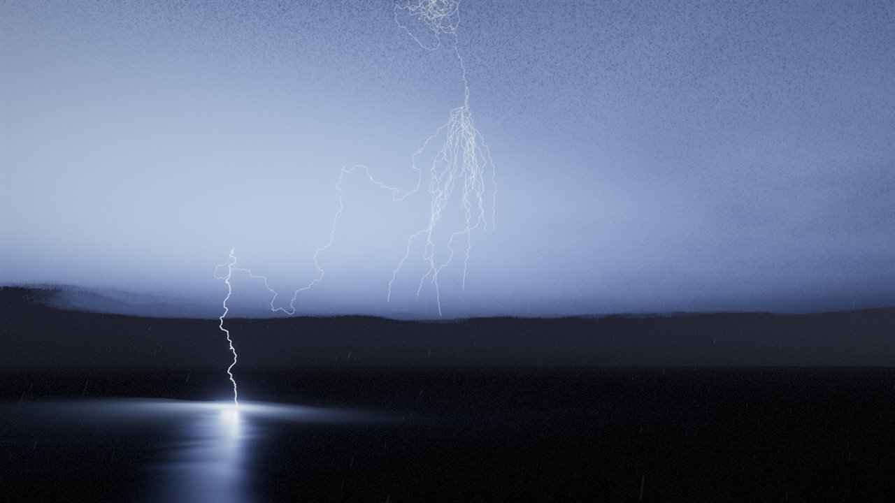
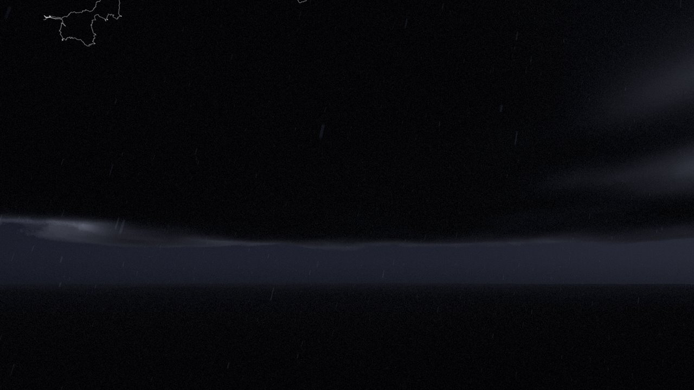
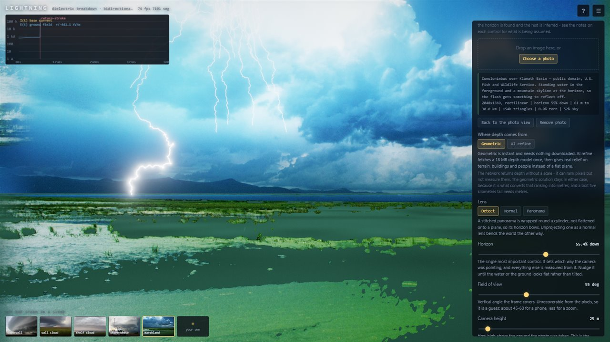
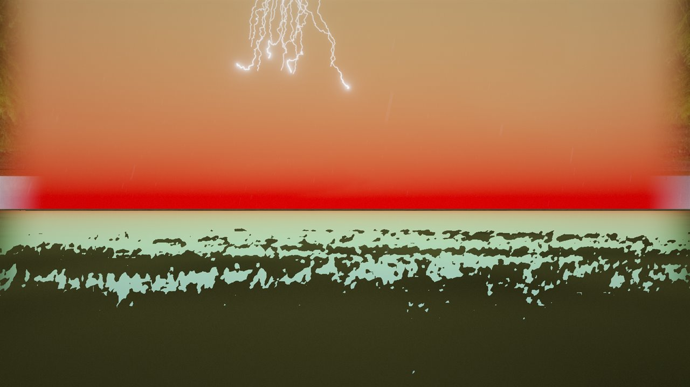
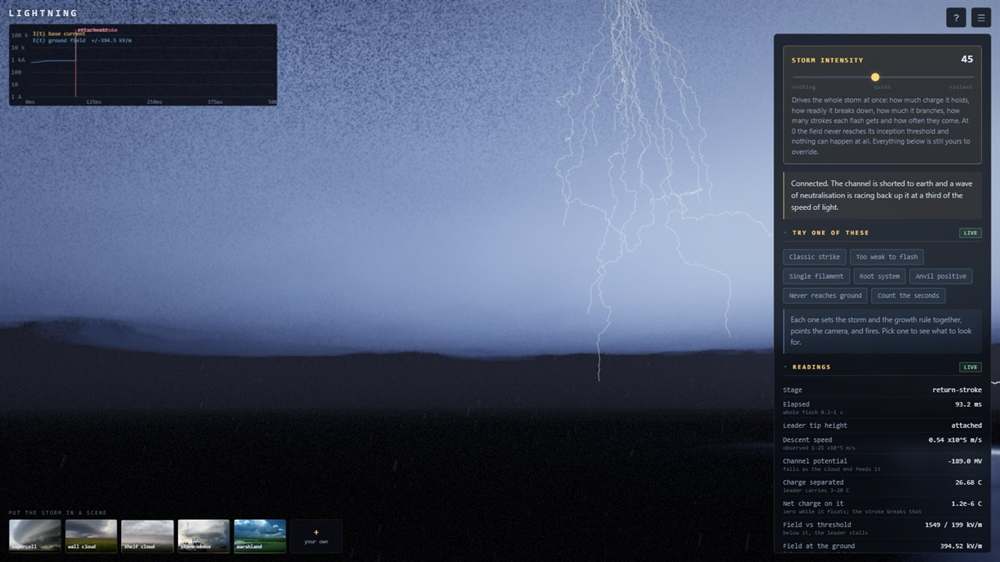

<div align="center">

# Lightning

**A lightning flash simulated from the electrostatics up, in the browser.**

[](https://github.com/aipulsedaily/lightning-sim/actions/workflows/ci.yml)
[](LICENSE)
[](#running-it)
[](https://threejs.org)
[](#status)



</div>

> [!NOTE]
> **Not maintained, and not accepting contributions — please fork.**
> This was built as one piece of work and is published because it may be
> useful, not to start a project that needs running. Issues and pull
> requests will most likely go unanswered. The licence is MIT: take it,
> change it, publish your own version. See [Status](#status).

Nothing here follows a path chosen in advance. The channel is grown one
step at a time by a stochastic rule whose only input is the local electric
field, and everything downstream — where it strikes, how much current it
carries, how hot it gets, what colour it is, what it sounds like — falls
out of that channel rather than being imposed on it.

It reproduces the measured numbers because it computes them, not because
they were typed in. Peak current comes from the charge the simulated leader
happened to lay down. Colour comes from Planck's law at the temperature the
energy balance produced. Thunder is the channel's own geometry, projected
onto the listener by the speed of sound.

## Running it

```bash
git clone https://github.com/aipulsedaily/lightning-sim.git
cd lightning-sim
npm start          # or: node serve.mjs
```

Then open <http://localhost:8000>. There is no build step and nothing to
install — `serve.mjs` is four dozen lines of Node standard library. ES
modules will not load over `file://`, so it does have to be served; any
static server will do.

**Requirements:** a browser with WebGL 2, and Node 18+ to run the server or
the tests. Three.js is the only runtime dependency, loaded from a CDN via
an import map. Everything else is procedural: no textures, no models, no
audio files.

```bash
npm test           # 54 checks against published measurements
```

## What you are looking at

<table>
<tr>
<td width="50%"></td>
<td width="50%"></td>
</tr>
<tr>
<td><b>The stepped leader</b>, groping downward at 10⁵ m/s, branching as it goes. Barely visible to the eye in life; obvious on a high-speed camera.</td>
<td><b>Your own photographs</b>, unprojected into a 3-D scene the lightning stands inside — behind the clouds, in front of the headland, lighting the water.</td>
</tr>
</table>

A flash is not a bolt, it is a sequence, and the parts happen on timescales
six orders of magnitude apart:

| Stage | Duration | What happens |
|---|---|---|
| Initiation | — | The ambient field first beats its local threshold, between two charge regions |
| Bidirectional leader | ~10 ms | The positive end climbs into the negative charge; the channel's floating potential collapses |
| Stepped leader | 20–60 ms | Branching descent at ~10⁵ m/s, laying several coulombs along tens of km of channel |
| Attachment | ~0.1 ms | An upward leader rises to meet it within a striking distance of ~10·*I*<sup>0.65</sup> m |
| Return stroke | ~0.1 ms | Neutralisation wave at *c*/3; 30 kA; 30 000 K |
| Interstroke | ~60 ms | Darkness |
| Dart leader | ~1 ms | Retraces the warm channel a hundred times faster, unbranched |
| Subsequent strokes | — | 12 kA, steeper front; 3–5 per flash typical |
| Continuing current | 40–500 ms | 100–200 A in about a third of flashes, with M-components |

The default playback gives each stage its own rate so all of them are
watchable, without touching the relative physics.

## Does it agree with reality?

Five flashes, straight out of the test suite:

```
seed 7          10 strokes  34 kA   6.6 C  26 kK  745 ms  49 km channel
seed 1234        4 strokes  24 kA   3.4 C  26 kK  196 ms  48 km channel
seed 4242        3 strokes  25 kA   3.3 C  26 kK  189 ms  45 km channel
seed 8675309     4 strokes  20 kA  21.7 C  22 kK  488 ms  59 km channel
seed 20260803    1 stroke   16 kA  39.4 C  22 kK  228 ms  53 km channel

leader:  ~10^5 m/s descent, tip potential -37 to -69 MV at attachment
```

| Quantity | Simulated | Measured |
|---|---|---|
| First-stroke peak current | 24 kA mean | 30 kA median |
| Charge transfer per flash | 15 C mean | 5–25 C |
| Peak channel temperature | 22–27 kK | 28 000–34 000 K |
| Strokes per flash | 4.4 mean | 3–5 mean, up to 26 |
| Leader descent speed | ~1 × 10⁵ m/s | 1–25 × 10⁵ m/s |
| Leader tip potential | −37 to −69 MV | −10 to −100 MV |
| Charge on the leader channel | 13–19 C | 3–20 C |

Every one of those is an **output**. Nothing in the model sets a peak
current or a temperature; they emerge from the charge the leader deposited
and the energy the return stroke dissipated.

Where the model is off, or where a constant is doing more work than it
should, is written down in
[Honest limitations](docs/PHYSICS.md#honest-limitations) rather than
quietly rounded away.

## How it works, briefly

The channel is grown by the **Dielectric Breakdown Model** (Niemeyer,
Pietronero & Wiesmann, 1984), which picks each step at random weighted by

$$p_i \propto (E_i - E_c)^\eta$$

over an electrostatic field solved by the charge simulation method — the
storm's charge regions as Gaussian blobs, the earth as a perfect conductor
imposed by images, and the growing channel as its own set of charges.

The piece that makes it behave is **Kasemir's floating potential**. A
lightning channel in a cloud is attached to nothing, so it is an isolated
conductor that must carry zero net charge, and its potential floats to
whatever value makes the induced charges cancel. That single condition
produces the whole opening act of a negative flash: the positive end climbs
into the negative charge region first, dragging the channel's potential
down with it, and only then does the negative end find itself tens of
megavolts below its surroundings and start driving for the ground. The
leader waits, then goes. Watch the *Channel potential* readout do it.

The full account — charge structure, the four distinct breakdown fields and
which is used where, the MTLE return stroke, the thermal and optical
models, the acoustics, and 39 sources — is in **[docs/PHYSICS.md](docs/PHYSICS.md)**.

## Putting it in a photograph



Drop any photo onto the window, or pick one of the five bundled
public-domain storm scenes, and it is unprojected into a 3-D scene the
lightning can stand inside. Click anywhere to move the storm there.

The horizon is found automatically — it fixes the camera's pitch, and
everything else is measured from it. Rays below it meet the ground plane,
rays above meet the cloud deck, which is what puts the reconstruction in
**metres** rather than arbitrary units, and metres is the whole point when
the thing being placed is five kilometres tall.

Depth Anything V2 can optionally be switched on to add real relief to the
foreground. It is fetched only if you ask for it, and the geometry stays
underneath, because an affine-invariant depth model can rank pixels but
cannot measure them.

Details, including why the network is confined to the near field and what
the state of the art does instead, are in
**[docs/PHOTO.md](docs/PHOTO.md)**.

## The interface



One dial drives the whole storm — charge, breakdown threshold, branching,
strokes per flash, how far the cell wanders, how often it fires. Below it,
every reading carries the range it ought to fall in, so a number means
something without having to look it up, and every control says what it will
do before it says why.

Controls that change how the discharge grows cannot affect the flash
already in the sky, so they quietly fire a new one when you let go. Not
saying so is the difference between a panel that seems broken and one that
does not.

## Things worth trying

- Set **Storm intensity** to 0. Nothing happens — the field never reaches
  its inception threshold anywhere, which is the honest way to render
  "off", and is what a storm is doing most of the time.
- Set **η** to 1, then to 6, and watch the channel go from a root system to
  a single filament.
- Turn **Retinal persistence** off during a return stroke, to see what the
  channel is really doing instant by instant. It will flicker and mostly be
  dark; the eye's tenth-of-a-second integration is the only reason anyone
  perceives a 200 µs event as a bolt.
- Enable sound, move the camera a long way back, and count the seconds.
- Switch to **Positive CG** and note the storm reconfigures: an upright
  tripole cannot produce one.
- Open the console: `lightning.flash.telemetry()`, `lightning.state`,
  `lightning.newFlash()`.

## Controls

| | |
|---|---|
| drag | orbit, or look around inside a photograph |
| right-drag / shift-drag | pan |
| wheel | zoom, or change the lens in a photo scene |
| click | move the storm there (with a photo loaded) |
| drop an image | build a 3-D scene from it |
| <kbd>space</kbd> | new flash |
| <kbd>r</kbd> | replay the same flash |
| <kbd>1</kbd> <kbd>2</kbd> <kbd>3</kbd> <kbd>4</kbd> | camera presets |
| <kbd>h</kbd> | hide the interface |
| <kbd>?</kbd> | the physics notes, in-app |

## Layout

```
src/core/      physics — no dependency on the renderer, runs under Node
src/photo/     photograph -> 3-D scene
src/render/    three.js: bolt, volumetric storm, terrain, rain, bloom
src/audio/     Web Audio convolution
src/ui/        panel, telemetry, oscilloscope
tests/         33 physics checks + 21 photo-geometry checks
assets/photos/ five public-domain storm photographs
```

`src/core/` imports nothing from `src/render/`, which is why the whole
physics stack can be tested headless under Node.

## Status

**Finished, unmaintained, and not accepting contributions.**

It does what it set out to do. There is no roadmap, nobody is on call, and
issues and pull requests will most likely go unanswered — so please don't
spend your time on them.

**Fork it instead.** The licence is MIT: use it, change it, publish your
version, build something commercial on it. No permission needed and no
attribution beyond keeping the copyright notice. If you fix something real,
fixing it in your fork and saying so in your README helps the next person
far more than an issue sitting unread here.

The code is deliberately separable, so you can take a piece without
adopting the whole thing — `src/core/` is the physics with no renderer and
runs headless under Node, `src/core/constants.js` is a cited table of
measured lightning parameters, `src/photo/` is the photograph
reconstruction, `src/render/bolt.js` is the HDR channel renderer.
[CONTRIBUTING.md](CONTRIBUTING.md) has the full map.

## Licence

[MIT](LICENSE).

The five bundled photographs in `assets/photos/` are **public domain** —
four from NOAA's National Severe Storms Laboratory and one from the US Fish
and Wildlife Service. Their provenance is recorded in
[assets/photos/CREDITS.md](assets/photos/CREDITS.md).
