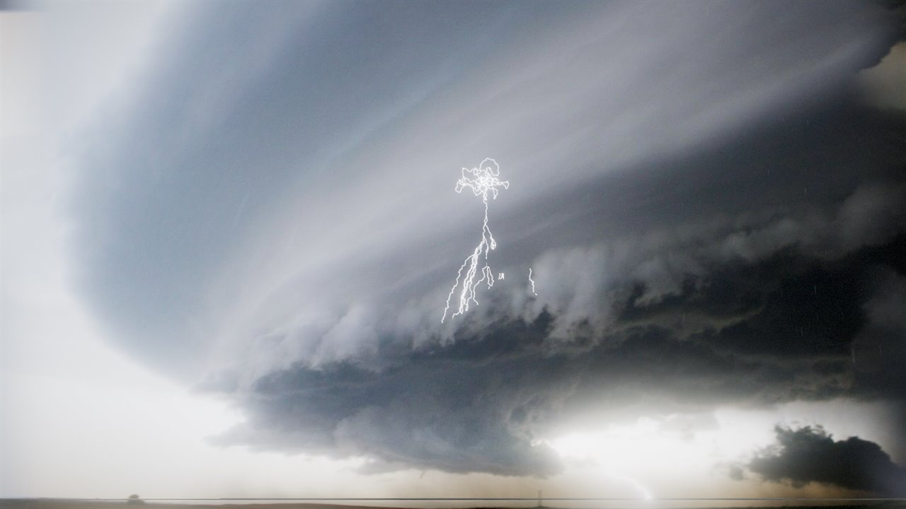

# Putting lightning in a photograph

How an uploaded image becomes a 3-D scene the simulation can stand
inside. The short version is in the [README](../README.md).



- [Horizon](#horizon)
- [Lens](#lens)
- [Geometric depth](#geometric-depth)
- [Neural depth](#neural-depth)
- [Mesh](#mesh)
- [Relighting](#relighting)
- [Outside the frame](#outside-the-frame)
- [What it handles badly](#what-it-handles-badly)

---


Five storm photographs are bundled in the strip at the bottom left, or drop
your own onto the window — either way it is unprojected into a 3-D scene
the lightning stands inside: behind the clouds, in front of the headland,
lighting the water. Click anywhere to move the storm there.

The bundled ones are all public domain, four from NOAA's National Severe
Storms Laboratory and one from the US Fish and Wildlife Service; their
provenance is in [`assets/photos/CREDITS.md`](../assets/photos/CREDITS.md), and `photos.json` is the whole
list, so adding more takes no code.

A photograph has no depth in it, so something has to be assumed. The
assumption that matters is not "which pixel is nearer" but "how many
metres away", because the thing being placed is five kilometres tall.
Ordering alone is useless at that scale.

```
photo ─► horizon + lens ─► DEPTH ─► mesh (torn, horizon-biased) ─► relight
                             │
                   ┌─────────┴─────────┐
             geometric               Depth Anything V2
             two-plane      ──fit──►  relative disparity
             (metric, 0 MB)           (18 MB, opt-in)
```

### Horizon

 Found by Otsu's method on a per-row "this looks like sky"
score built from brightness, blueness and local contrast — parameter-free,
and it reports a separability score. A clean sea horizon comes back at
0.99 confidence; featureless noise at 0.00, and the panel then says so and
asks you to place it by hand. The horizon is not cosmetic: it is the set
of rays with zero elevation, so it fixes the camera's pitch, and pitch is
what turns a pixel into a direction.

### Lens

 A stitched panorama is wrapped round a cylinder, not flattened
onto a plane, so horizontal position is proportional to azimuth rather
than its tangent and the horizon bows. Unprojecting one as a pinhole bends
the world the other way and throws the edges to absurd distances. Anything
past 2.2:1 is treated as cylindrical unless overridden.

### Geometric depth

 Rays below the horizon meet the ground plane, rays
above meet the cloud deck; both intersections are exact given the camera
height and the cloud base, so the answer is in metres by construction.
Rays near the horizon meet neither, and a hard cut-off there creases the
image, so the two are combined reciprocally — `1/t = 1/t_plane + 1/max` —
which folds the far field smoothly into a curtain that distant hills and
skylines stand on.

### Neural depth

 Depth Anything V2 Small, lazily fetched only if asked
for, with the backend probed *before* downloading: `shader-f16` is missing
on plenty of real hardware and every software renderer, and asking for the
18 MB `q4f16` build there fails outright rather than degrading. It falls
through WebGPU/q4 to WASM.

The model returns affine-invariant disparity — it can rank pixels but not
measure them — so it is fitted to the geometry by least squares in inverse
depth, with reweighting to reject outliers. Crucially the fit is anchored
on the **near field only**. These models saturate at zero disparity past a
hundred metres or so, and on a photograph of a bay that is the sea, the
far shore, the mountain and the whole sky. Fitting across all of it forces
the curve through a huge cloud of points that all claim infinity and
collapses the scene into a few hundred metres — which is exactly what
happened the first time. So the network owns the foreground, the geometry
owns the distance, and the handover is smooth.

### Mesh

 Vertices move only along their own rays, so the photograph
reprojects exactly from its own viewpoint no matter how much relief is
applied — checked in the tests to 2×10⁻⁶ degrees. Rows are bunched
towards the horizon, because distance to a plane goes as 1/sin(depression)
and almost the entire depth range of the scene is squeezed into the last
degree or two.

Quads spanning a depth discontinuity are dropped rather than stretched: a
torn edge reads as a silhouette, a stretched one as melted plastic. But
tearing is confined to the foreground and exempt at the horizon, because a
depth *ratio* is a poor edge detector — a flat plane seen almost edge-on
produces enormous ratios with no discontinuity at all, and reading that as
an edge tears a black band clean across the frame.

### Relighting

 The photograph already contains the light that was falling
when it was taken, so its pixels are treated as albedo and the flash is
added on top: `out = photo × (1 + response)`. At zero you get the original
image back exactly. Sky and ground respond differently — cloud scatters
almost regardless of which way it faces, a hillside obeys a cosine law —
and the sky mask blends between them.

Occlusion comes free from the geometry, with one deliberate exception: the
photograph's sky sits on a single deck a kilometre or two up, which is
*below* most of a thunderstorm, so by default it draws without writing
depth and acts as the backdrop it visually is. The ground and everything
in the foreground keep their real depth and go on occluding the channel
properly. "Behind clouds" restores the honest version.

**At the photograph's viewpoint the camera looks around rather than
orbits.** The reconstruction is only valid from where the picture was
taken, and orbiting a target a kilometre out swings the camera hundreds of
metres sideways for a small drag, straight into the geometry's blind
spots. Wheel changes the lens instead of the distance.

## Outside the frame

A photograph covers only the solid angle its lens saw. Turn past that and
there is nothing, which reads as a bug however honestly it represents the
missing information — and it makes the scene feel like a picture on a wall
rather than a place.

So the whole sphere is painted. Every ray is projected *back* through the
recovered camera model into image coordinates: inside the frame you get the
photograph, just outside it the edge carried outwards and softened, and far
outside a gradient built from the photograph's own average sky and ground
colours, split at its own horizon and broken up with cloud-shaped noise so
it has structure rather than being a flat fill. None of that is new
information; it is *consistent* information, derived entirely from the
image in hand. It also fills the gaps the mesh tears open at silhouettes,
since it is drawn behind everything.

A ground plane goes underneath all of it, painted with the photograph's own
ground colour and following the viewer so its edge is never reachable. That
one addition is what stops the scene reading as a floating scrap: a
reconstruction is a shell covering only the lens's field of view, so seen
from the side it is a wedge with its apex at the camera, and giving it a
floor turns that wedge into a textured patch of a landscape that continues
past it. The outer border of the shell dissolves rather than ending in a
hard cut, and with a photograph loaded the orbit is kept on a short leash —
from far enough away no amount of dressing hides what it is.

The state of the art here is generative: **PanoDreamer** (SIGGRAPH Asia
2025) and **CamFreeDiff** (CVPR 2025) outpaint a full 360° panorama with a
diffusion model, estimate depth across it, inpaint the disocclusions and
fit Gaussian splats. That pipeline is the same shape as this one — extend,
depth, layer, project — with a diffusion model doing the extending and the
inpainting instead of a palette and some noise. It also needs hundreds of
megabytes of weights and minutes of GPU time per image, so it is not a
browser feature yet.

Worth noting that Apple's Spatial Scenes (iOS 26) does essentially what is
done here — separate into layers, estimate depth, parallax — and keeps the
motion small for exactly the same reason: past a certain angle there is
nothing behind the foreground to show.

## What it handles badly

Close-up subjects, interiors, anything with no horizon. The panel says so
when the horizon confidence is low.

Orbiting far from the original viewpoint reveals gaps behind foreground
objects — there is nothing there because the camera never saw behind them,
and filling those in properly is layered depth inpainting, a second network
and out of scope. The environment and the ground plane make that view
coherent rather than broken, but it is still a diorama seen from outside,
and no amount of dressing changes that. The photograph's own viewpoint is
the one the reconstruction is actually valid from; everything else is a
courtesy.

